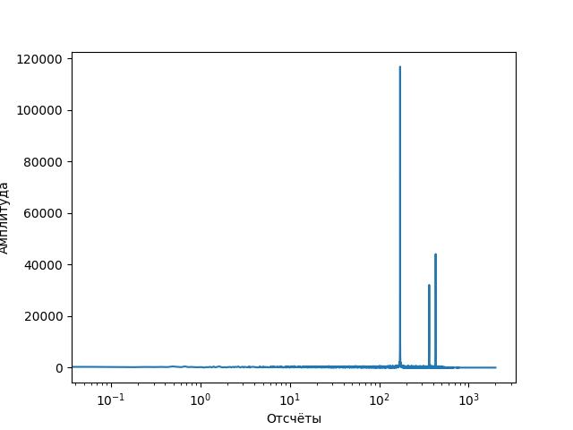

# Задание

Изучить метод фильтрации сигналов во временной области с использованием рекурсивной фильтрации. Осуществить моделирование работы фильтра для сигналов различных видов. В работе используется ФНЧ Баттерворта 8-ого порядка с частотой среза 500 Гц

# Результат

На основе аналогового прототипа cгенерирован нерекурсивный фильтр с указанными выше параметрами. В рамках данной работы порядок фильтра равен 256:

Через полученный фильтр пропущен синусоидальный сигнал со следующими частотами гармоник 171.36, 428.11, 362.33 и амплитудами гармоник 5, 3, 4 соотвественно

Фильтрация сигнала после добавления к нему гауссовской помехи с мат. ожиданием равным 0 и дисперсией равной 1:

Фильтрация сигнала с гармонической помехой состоящей из двух гармоник синусоидального сигнала с частотами 557 и 950 Гц и амплитудами равными 1:

Спектр сигнала с гауссовским шумом после фильтрации:

# Выводы

По сравнению с нерекурсивным фильтром [с такими же характеристиками](https://github.com/TestPortf/portfolio/tree/main/MetUstrCifrObr/1sem/practika/prac4) фильтрация выполняется быстро.

